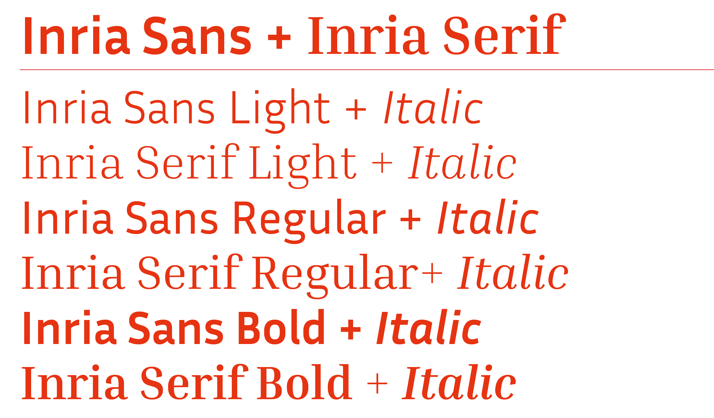

# Inria Sans and Inria Serif

```
Inria Sans and Inria Serif are the two members of a type family design for the communication of Inria, 
a national institut dedicated to numeric research. The Institut needed a font showing its values 
at the crossroad of humanity, technology, excellence and creativity. Black[Foudry] created a humanist 
typeface with a unapologetically contemporary design as the Sans-serif part and a more rational axis 
and drawing for the serif. Both members comes in 3 weights with matching italics.
```


## Features
```
Ligatures
Old Style Figures
Lining Tabular Figures
Superiors and inferiors
Dynamic fractions
Stylistic Set 01 : Swashed Capitals
Stylistic Set 02 : Arrows
Case sensitive punctuations
```

## xeLaTeX usage
```
\usepackage{mathspec}
\setmainfont{Inria Sans}[Scale=MatchLowercase]
\setsansfont{Inria Sans}[Scale=MatchLowercase]
\setmathfont(Digits,Latin,Greek,Symbols)[Scale=MatchLowercase]{Inria Serif}
\setmathrm[Scale=MatchLowercase]{Inria Sans}
\usepackage{mathastext}
```